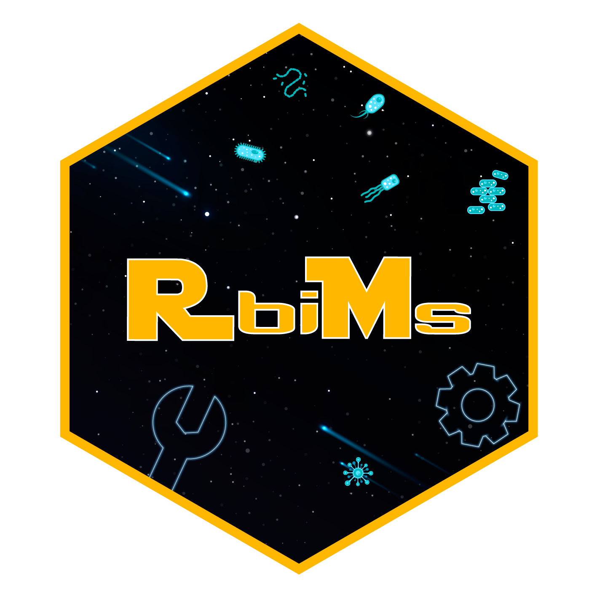

# RbimsRladies2024

## Introducción a Rbims en R 

¡Saludos cordiales!

En esta sesión de R ladies aprenderemos a utilizar el paquete **Rbims** para el análisis de metabólico de genomas, dónde podremos cargar datos de predicciones funcionales realizadas con diferentes bases de datos (dbCAN, InterproScan, KEGG, eentre otros) además de manipuarlos y  visualizar los datos funcionales obtenidos.

## Temas

+ Introducción a Rbims
  + Ecología microbiana y Metagenómica
  + Genomas ensamblados de Metagenomas (MAGs)
  + Predicción funcional
  + Bases de datos para predicción funcional
+ Ejercicio ejemplo para el uso de Rbims

## Fecha 
Lunes 4 de marzo de 2024


## Facilitadoras:

- Biól. Karla Paola López Martínez

Karla funge como asistente de investigación en el Instituto de Ciencias del Mar y Limnología. Recientemente ha estado trabajando como desarrolladora en mejoras del paquete Rbims. 

- Ph.D. Stephanie Elizabeth Hereira Pacheco

Stephanie es investigadora del Centro de Investigación en Ciencias Biológicas de la Universidad Autónoma de Tlaxcala. Tiene experiencias en análisis bioinformáticos y estadísticos y en programación en el lenguaje R. 


## Requisitos de la sesión

- Tener instalado **Rbims**, para esto:

Puedes acceder a la versión final en el repositorio de [GitHub](https://github.com/mirnavazquez/RbiMs).

O en la consola de R:

``` r
install.packages("devtools")
```

Si estás en MAC, necesitarás descargar [XQuartz](https://www.xquartz.org/). Y si estás en ubuntu debes instalar libcairo2-dev, para más información [aquí](https://stackoverflow.com/questions/51940792/r-cairo-package-installation-failed-in-ubuntu-18-04).

``` r
library(devtools)
install_github("mirnavazquez/RbiMs")
library(rbims)
```

- Los datos que se utilizarán en esta sesión, para esto puedes clonar o descargar el presente repositorio: da click en el botón Code > Download zip. 

O usar el comando `git clone https://github.com/landalab0/RbimsRladies2024.git ` desde tu terminal para clonar el repositorio.


## Requerimientos de software

+ R >=4.0 y RStudio

+ Paquetes de R: tidyverse y rstatix, los cuades puedes instalar con la instrucción:

`install.packages(c("rstatix", "tidyverse", "readxl"), dependencies = TRUE)`


## Código de Conducta
Recuerda leer y atender el código de conducta de Rladies disponible en https://rladies.org/code-of-conduct/ o https://rladiesmx.netlify.app/codigo_de_conducta/

